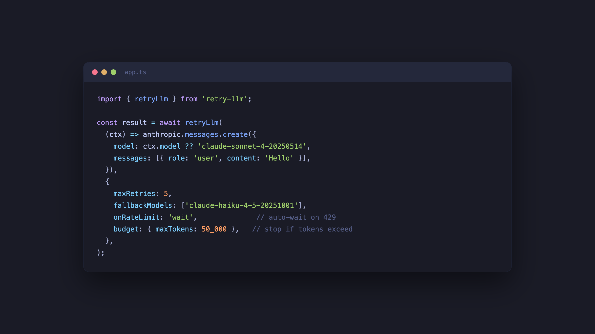

# retry-llm

> Smart retry for LLM API calls — rate limits, model fallback, token budgets

<p align="center">
	
</p>

Anthropic and OpenAI SDKs already retry twice on failures. retry-llm is for when that's not enough:

- **Your app uses multiple models for reliability.** Opus is rate limited at 2am? Automatically fall back to Sonnet, then Haiku. No nested try/catches, no state tracking — just a `fallbackModels` array.
- **You're doing batch processing and need cost control.** Set a token budget so a retry loop doesn't blow your bill overnight. `budget: { maxTokens: 50_000 }` and it stops.
- **You want instant model switching on rate limits, not waiting.** SDKs wait 30+ seconds on 429. Set `onRateLimit: 'fallback'` to immediately try a cheaper model instead.
- **You use multiple providers in the same app.** One retry strategy across Anthropic, OpenAI, Google, DeepSeek — instead of each SDK doing its own thing independently.

If you're making simple single-model API calls, the built-in SDK retry is probably fine. You don't need this.

## Features

- **Rate limit handling** — auto-waits on 429/529 using `retry-after` headers
- **Model fallback** — cascade through cheaper models when the primary fails
- **Token budgets** — stop retrying when cumulative tokens exceed a threshold
- **Provider-agnostic** — works with Anthropic, OpenAI, Google, or any HTTP-based SDK
- **Error classification** — knows which errors are retryable and which aren't
- Zero dependencies

## Install

```sh
npm install retry-llm
```

## Usage

```js
import {retryLlm} from 'retry-llm';

// Simple — just wrap your LLM call
const result = await retryLlm(() => anthropic.messages.create({
  model: 'claude-sonnet-4-20250514',
  messages: [{role: 'user', content: 'Hello'}],
}));
```

With model fallback and budget tracking:

```js
const result = await retryLlm(
  ctx => anthropic.messages.create({
    model: ctx.model ?? 'claude-sonnet-4-20250514',
    messages: [{role: 'user', content: 'Hello'}],
  }),
  {
    maxRetries: 5,
    fallbackModels: ['claude-haiku-4-5-20251001'],
    onRateLimit: 'wait',
    budget: {maxTokens: 50_000},
  },
);
```

## API

### retryLlm(fn, options?)

Returns a `Promise<T>` with the result of `fn`.

#### fn

Type: `(ctx: RetryContext) => Promise<T>`

The function to retry. Receives a context object with the current attempt, model, and token usage.

#### options

Type: `object`

##### maxRetries

Type: `number`\
Default: `3`

Maximum retries per model before falling back or giving up.

##### fallbackModels

Type: `string[]`\
Default: `[]`

Ordered list of models to try after the primary exhausts retries. The current model is passed to your function via `ctx.model`.

##### onRateLimit

Type: `'wait' | 'fallback' | 'throw'`\
Default: `'wait'`

What to do on 429/529 errors:
- `'wait'` — parse `retry-after` header and sleep, then retry
- `'fallback'` — skip to the next model immediately
- `'throw'` — throw the error, no retry

##### budget

Type: `{maxTokens?: number}`

Stop retrying when cumulative tokens exceed the limit. Tracks `usage.input_tokens + usage.output_tokens` (Anthropic) or `usage.prompt_tokens + usage.completion_tokens` (OpenAI) from successful responses. Throws `BudgetExceededError` when exceeded.

##### baseDelay

Type: `number`\
Default: `500`

Base delay in milliseconds for exponential backoff.

##### maxDelay

Type: `number`\
Default: `30000`

Maximum delay cap in milliseconds.

##### jitter

Type: `boolean`\
Default: `true`

Add randomness to backoff delays to prevent thundering herd.

##### signal

Type: `AbortSignal`

Abort retrying when the signal fires.

##### shouldRetry

Type: `(error: unknown) => boolean | Promise<boolean>`

Custom predicate to decide whether to retry. Called after the built-in error classification. Return `false` to stop retrying and throw the error.

##### onRetry

Type: `(error: unknown, context: RetryContext) => void`

Callback fired before each retry. Useful for logging.

### RetryContext

```ts
interface RetryContext {
  attempt: number;      // 1-indexed, resets per model
  model: string | null; // current fallback model, null for primary
  totalAttempts: number; // across all models
  tokensUsed: number;   // cumulative (if budget tracking enabled)
}
```

### RetryError

Thrown when all retries and fallback models are exhausted.

```ts
class RetryError extends Error {
  readonly lastError: unknown;
  readonly attempts: number;
  readonly modelsAttempted: string[];
}
```

### BudgetExceededError

Thrown when token budget is exceeded.

```ts
class BudgetExceededError extends Error {
  readonly tokensUsed: number;
  readonly budget: number;
}
```

## How it works

1. Calls your function
2. On error, classifies it: rate limit (429), overloaded (529), server (500+), auth (401/403), bad request (400/404/413/422), connection error
3. Auth and bad request errors throw immediately — no retry
4. Retryable errors wait with exponential backoff + jitter
5. Rate limits parse `retry-after` / `retry-after-ms` headers for precise wait times
6. After exhausting `maxRetries`, moves to the next model in `fallbackModels`
7. After all models exhausted, throws `RetryError`

## FAQ

#### How is this different from p-retry?

p-retry is generic. retry-llm understands LLM-specific error codes (429 vs 529), parses `retry-after` headers from Anthropic/OpenAI, supports model fallback chains, and tracks token budgets. It's the retry you put *around* your LLM SDK client.

#### Don't the SDKs already retry internally?

Yes — Anthropic and OpenAI SDKs retry 2x by default. retry-llm is for when you need more control: model fallback, budget limits, custom rate limit behavior, or more retries. Wrap the SDK call — both retry layers work together.

#### How accurate is budget tracking?

Approximate. It tracks tokens from successful responses only (failed calls don't return usage data). It's a safety net, not an accounting system.

## Related

- [p-retry](https://github.com/sindresorhus/p-retry) - Generic retry for promises

## License

MIT
